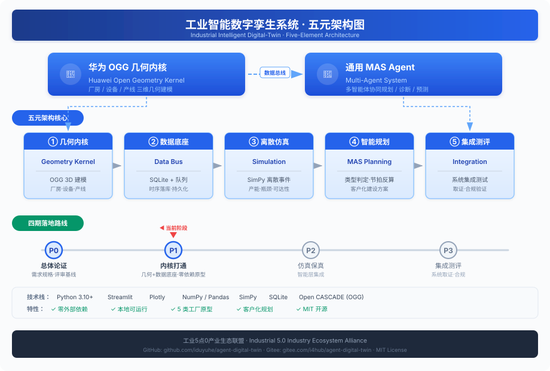
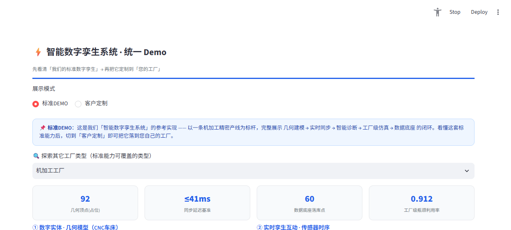

<p align="center">
  
</p>

<h1 align="center">工业智能数字孪生系统 · 零依赖参考实现</h1>

<p align="center">
  <strong>Industrial Intelligent Digital-Twin — Zero-Dependency Reference Implementation</strong>
</p>

<p align="center">
  <a href="https://github.com/iduyuhe/agent-digital-twin"></a>
  <a href="https://gitee.com/i4hub/agent-digital-twin"></a>
  
  
  
</p>

<p align="center">
  华为 OGG 几何内核 + 通用 MAS Agent 双引擎 · 五元架构 · 四期落地路线（P0–P3）<br/>
  由 <strong>工业5点0产业生态联盟</strong> 开源维护
</p>

---

## ✨ 项目简介

本项目是一套**可本地零依赖运行**的工业智能数字孪生参考实现，目标是把"数字孪生"从 PPT 概念落到可演示、可二次开发的工程骨架：

| 能力域 | 说明 | 本仓库体现 |
|--------|------|-----------|
| 🔷 **几何内核** | 厂房 / 设备 / 产线的三维几何建模 | `P1_W1_开工脚手架/`（OGG 编译与 Docker 化）+ `demo_geometry_occ.py` |
| 📡 **数据底座** | SQLite + 内存队列替代 EMQX+IoTDB，零外部依赖演示完整数据链路 | `demo_databus_sqlite.py`（DataSource 适配层：模拟 / CSV / MES-REST） |
| ⚙️ **离散仿真** | SimPy 产线产能 / 瓶颈 / 可达性仿真，5 类工厂原型 | `factory_sim_core.py` |
| 🤖 **智能规划** | 公司/产品 → 类型判定 → 节拍反算设备数 → 仿真验证，自动生成建设方案 | `planner_core.py` |
| 📊 **集成测评** | 系统级测试、取证、合规验证 | P3 启动包文档 |

整套 Demo **仅需 Python**，无需 Docker、无需联网、无需任何商业中间件即可跑通。

---

## 🎯 核心特性

- **零外部依赖** — 无需 Docker/Kafka/IoTDB，`pip install` 即跑
- **5 类工厂原型** — 机加工 / 装备装配 / 半导体 / 汽车流水线 / 电子组装
- **双模式入口** — 标准 DEMO（标杆参考工厂）+ 客户定制（输入公司/产品自动生成方案）
- **四面板闭环** — 几何 3D 模型 · 实时传感三轴曲线 · 工厂级仿真利用率 · 数据底座 SQLite 回查
- **客户化规划器** — 输入公司名或产品描述 → 自动判定工厂类型 → 按节拍反算设备 → 生成可下载 HTML 规划书
- **数据源适配层** — SimulatedSource(默认) / CsvFileSource(MES回放) / MesRestSource(占位)，上线真实系统无缝切换

---

## 🚀 快速开始

### Prerequisites

- **Python 3.10+**（推荐 3.13）

```bash
# 安装依赖
pip install -r P1_Demo零依赖原型/requirements.txt

# 启动统一 Demo（标准DEMO + 客户定制 双模式）
streamlit run P1_Demo零依赖原型/demo_unified.py --server.port 8505
```

浏览器打开 **http://localhost:8505**

> 统一 Demo 顶部可在「**标准DEMO**」（以机加工标杆产线讲清系统能力）与「**客户定制**」（输入公司/产品+参数，自动生成你的工厂方案）之间切换。

### Demo 截图

<p align="center">
  
</p>

---

## 📁 目录结构

```
agent-digital-twin/
├── README.md                      # 本文件
├── LICENSE                        # MIT
├── CONTRIBUTING.md                # 贡献指南
│
├── docs/                          # 文档与资源
│   ├── architecture.svg           # ★ 五元架构图（SVG 内联渲染）
│   ├── assets/
│   │   └── demo_standard_mode.png # Demo 运行截图
│   └── planning/                  # 规划文档与汇报材料
│       ├── P0-P3全期执行总览.html
│       ├── P0评审会议材料.html
│       ├── P0需求规格与标准符合性基线.html
│       ├── P0评审汇报.pptx
│       ├── P1启动包_几何内核与数据底座打通.html
│       ├── P2启动包_仿真保真与智能层集成.html
│       ├── P3启动包_系统集成与测评取证.html
│       ├── 华为OGG_Agent数字孪生论证分析.html
│       ├── 智能数字孪生系统建设规划方案.html
│       └── build_pptx.js / deck_text.txt
│
├── P1_Demo零依赖原型/             # ★ 核心：零依赖 Demo
│   ├── requirements.txt           # Python 依赖
│   ├── demo_unified.py            # 统一入口（标准DEMO + 客户定制 双模式）
│   ├── demo_app.py                # 几何/传感/仿真/数据底座 四面板渲染原语
│   ├── factory_sim_core.py        # 5 类工厂仿真内核
│   ├── planner_core.py            # 客户化规划器核心
│   ├── demo_databus_sqlite.py     # 数据底座（SQLite + DataSource 适配层）
│   ├── demo_geometry_occ.py       # OGG 几何建模桥接
│   ├── demo_factory.py            # 工厂级选择器 + 参数滑块
│   ├── demo_planner.py            # 规划器 UI
│   ├── demo_databus_app.py        # 数据底座探查 UI
│   ├── demo_agent_local_llm.py    # 本地 LLM Agent 演示
│   ├── p2_intelligence.py         # P2 智能层（诊断/预测/决策 三类 Agent）
│   ├── p2_cae_fidelity.py         # P2 装备级 CAE 保真（FEM 梁 + FDM 热传导）
│   ├── make_demo_preview.py       # 静态预览页生成
│   └── mes_export_sample.csv      # MES 样例数据
│
└── P1_W1_开工脚手架/             # OGG 几何内核编译 / 容器化脚手架
    ├── CMakeLists.txt / Dockerfile / docker-compose.yml
    ├── build_ogg.sh / hello_geometry.cpp
    ├── local-stack/               # 本地消息/时序中间件栈
    └── README.md
    # 注：ogg_src/（1.1G Open CASCADE 上游源码）不入库，请按 README 自行拉取
```

---

## 🔧 核心模块说明

### 数据底座适配层 (`demo_databus_sqlite.py`)
通过 `DataSource` 抽象内置三类数据源，上线真实系统后只需替换实现：
- `SimulatedSource`：默认，本地随机过程模拟设备信号
- `CsvFileSource`：从 MES 导出的 CSV 回放
- `MesRestSource`：对接真实 MES/SCADA 的 REST 接口（占位实现）

`LivePipeline(source=...)` 统一驱动"采集 → 总线分发 → 时序落库 → 持久化"。

### 工厂仿真内核 (`factory_sim_core.py`)
`FACTORY_LIBRARY` 内含 5 类工厂原型，每类含工位拓扑、节拍、设备数、痛点与推荐建设要点。支持新建厂规划与存量厂优化两种场景。

### 客户化规划器 (`planner_core.py`)
`detect_factory_type(text)`（关键词启发式）→ `derive_plan(...)`（按系统节拍 `T = 年工时 / 年产量` 反算各工位设备数）→ `render_plan_html()`（导出规划书）。

示例：输入"新能源汽车动力电池包"→ 自动判定为汽车流水线 → 反算设备 → 仿真验证产能可达性 **99.9%**。

---

## 🛣️ 四期落地路线

| 阶段 | 名称 | 目标 | 状态 |
|------|------|------|------|
| **P0** | 总体论证 | 需求规格、标准符合性、方案评审基线 | ✅ 已完成 |
| **P1** | 内核打通 | 几何内核 + 数据底座打通（零依赖原型） | ✅ 已完成 & 公开 |
| **P2** | 仿真保真 | 仿真精度提升 + MAS 智能层集成 + CAE 保真 | 🔵 **当前阶段** |
| **P3** | 集成测评 | 系统集成测试、取证、合规验证 | ⏳ 待启动 |

---

## 🤝 参与贡献

欢迎 Issue / PR / Star！详见 [CONTRIBUTING.md](./CONTRIBUTING.md)。

- 报告问题 → [GitHub Issues](https://github.com/iduyuhe/agent-digital-twin/issues) 或 [Gitee Issues](https://gitee.com/i4hub/agent-digital-twin/issues)
- 提交代码 → Fork → 创建功能分支 → 提交 PR
- 讨论交流 → [GitHub Discussions](https://github.com/iduyuhe/agent-digital-twin/discussions)

---

## 📄 开源协议

本项目以 **[MIT License](./LICENSE)** 开源。自由使用、修改、分发，请保留版权声明。

---

## 🔗 双平台同步

本仓库同时在 GitHub 与 Gitee 开源，内容保持一致：

| 平台 | 地址 |
|------|------|
| **GitHub** | https://github.com/iduyuhe/agent-digital-twin |
| **Gitee** | https://gitee.com/i4hub/agent-digital-twin |

---

<p align="center">
  <sub>© 2026 工业5点0产业生态联盟 · Industrial 5.0 Industry Ecosystem Alliance</sub>
</p>
